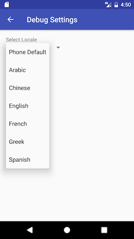

# DebugInjector Pattern Sample

## Overview
This repo demonstrates the DebugInjector Pattern. This pattern describes how to securely
implement debug-only functionality in an Android Application.

## Locale Hello World App
The sample application consists of a simple Hello World App that supports multiple locale's. The app
contains a **Debug Settings** menu that is only available when `BuildConfig.DEBUG==true`. The
settings screen allows the developer/tester to switch the application's locale without having to
change the Android System Language Settings (which is rarely fun).

**Use Cases**

* As the app developer/tester I want to easily test locale changes in debug builds
* As a project manager I want to ensure debug functionality is not included in release builds
(security, efficiency)
* As a hacker, I **SHALL NOT** be able to exercise or reverse engineer
any of the debug functionality in a release build.

**Screen Shots**


  
  

## DebugInjection Pattern
The DebugInjection Pattern is a name for a technique that has been implemented a
million times, adding debug-only functionality to an applications. The key is to encapsulate
the debug-only functionality in a manner that allows the behavior to be totally absent from
release builds. The Android platform makes this easy by providing the ability to use different
versions of a source/resource file for a given build variant
(see [sourceSets](https://developer.android.com/studio/build/build-variants.html#sourcesets)).

### Abstract Class

The Locale Hello World app demonstrates this pattern in the `DebugInjector.java` class. This
abstract class defines all the behavior available to debug builds and provides a static
creation method to encapsulate instantiation to this file.

**DebugInjector.java**
```java
/**
 * Abstract class demonstration the DebugInjector Pattern.
 *
 * This class defines the behavior for the debug-only functionality
 * and provides a convenience method for instantiating the build-type
 * specific implementation.
 */
public abstract class DebugInjector {

    private static DebugInjector sDebugInjector;

    public static DebugInjector getInstance(Context context) {

        if (sDebugInjector == null) {
            // There are 2 version of DebugInjectorImpl.java
            //    debug   - actual implementation
            //    release - no-op implementation
            sDebugInjector = new DebugInjectorImpl(context);

        }
        return sDebugInjector;
    }

    public abstract void startSettingsActivity(Activity activity);

    public abstract boolean overrideLocale(Activity activity);

}
```

### Debug and Release Implementations

The implementation is distributed across two `DebugInjectImpl.java` classes provided in the
`/debug` and `/relase` folders. The `/release` version provides a simple no-op implementation
while the `/debug` version does the real work.

**release/DebugInjectorImpl.java**
```java
public class DebugInjectorImpl extends DebugInjector {

    public DebugInjectorImpl(Context context) {
    }

    @Override
    public void startSettingActivity(Activity activity) {
    }

    @Override
    public boolean overrideLocale(Activity activity) {
        return false;
    }

}
```

**debug/DebugInjectorImpl.java**
```java
public class DebugInjectorImpl extends DebugInjector {

    private final static String PREFS_DEBUG_SETTINGS = "com.blackpixel.debuglocale.injector.pref_debug_setting";

    private final SharedPreferences sharedPrefs;

    public DebugInjectorImpl(Context context) {
        this.sharedPrefs = context.getSharedPreferences(PREFS_DEBUG_SETTINGS, Context.MODE_PRIVATE);
    }

    @Override
    public void startSettingsActivity(Activity activity) {
        activity.startActivity(DebugSettingsActivity.newIntent(activity));
    }

    @Override
    public boolean overrideLocale(Activity activity) {

        boolean override = true;
        ...
        ...
        return override;
    }
}
```

### Debug Manifest Files

The functionality in this sample includes a debug-only Activity which needs to be declared in
the `/debug` version of the `AndroidManifest.xml` file. This takes advantage of Android's
[Manifest Merge](https://developer.android.com/studio/build/manifest-merge.html) capabilities
which is really cool (but has also gotten me into trouble a couple of times with third-partly libs).

**debug/AndroidManifest.xml**
```xml
<manifest xmlns:android="http://schemas.android.com/apk/res/android">
    <application>
        <activity
            android:name="com.blackpixel.debuglocale.injector.DebugSettingsActivity"
            android:label="@string/title_activity_debug_settings">
            <meta-data
                android:name="android.support.PARENT_ACTIVITY"
                android:value="com.blackpixel.debuglocale.MainActivity" />
        </activity>
    </application>
</manifest>
```

### Putting It All Together

The debug functionality is initiated from the `MainActivity.java` class. This class calls
`DebugInejctor.getInstance()` method and assigns the result to a method variable. The
`startSettingsActivity()` is then called to respond to the **Debug Settings** menu click
and `getOverrideLocale()` is called from the `onResume` override.

**MainActivity.java**
```java
public class MainActivity extends AppCompatActivity {

    private DebugInjector debugInjector = null;

    private TextView helloWorldTextView;
    private TextView dateTimeTextView;

    @Override
    protected void onCreate(Bundle savedInstanceState) {
        super.onCreate(savedInstanceState);
        setContentView(R.layout.activity_main);

        helloWorldTextView = (TextView) findViewById(R.id.main_hello_world_tv);
        dateTimeTextView = (TextView) findViewById(R.id.main_date_time_tv);

        if (BuildConfig.DEBUG) {
            debugInjector = DebugInjector.getInstance(this);
        }
    }

    @Override
    public void onResume() {
        super.onResume();
        if (BuildConfig.DEBUG) {
            debugInjector.overrideLocale(this);
        }
        updateUi();
    }

    private void updateUi() {
        helloWorldTextView.setText(R.string.hello_world);
        dateTimeTextView.setText(DateFormat.getDateTimeInstance(DateFormat.LONG, DateFormat.LONG)
                .format(new Date()));
    }

    @Override
    public boolean onOptionsItemSelected(MenuItem item) {
        boolean handled;

        switch (item.getItemId()) {
            case R.id.setting_app:
                handled = true;
                break;
            case R.id.setting_debug:
                if (BuildConfig.DEBUG) {
                    debugInjector.startSettingsActivity(this);
                }
                handled = true;
                break;
            default:
                handled = super.onOptionsItemSelected(item);
                break;
        }

        return handled;
    }
}
```

### Unit Testing

It is important to remember that Android's Unit Test framework also supports folder based
build variant overrides. This requires any Unit Tests written against the debug version of
 `DebugInjectImpl.java` to be placed under the `testDebug` folder.


